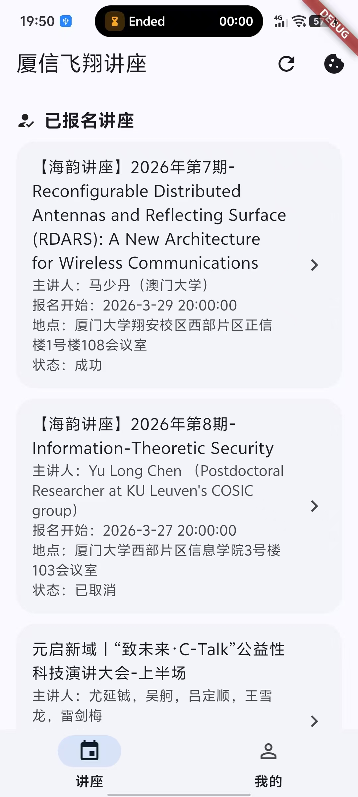
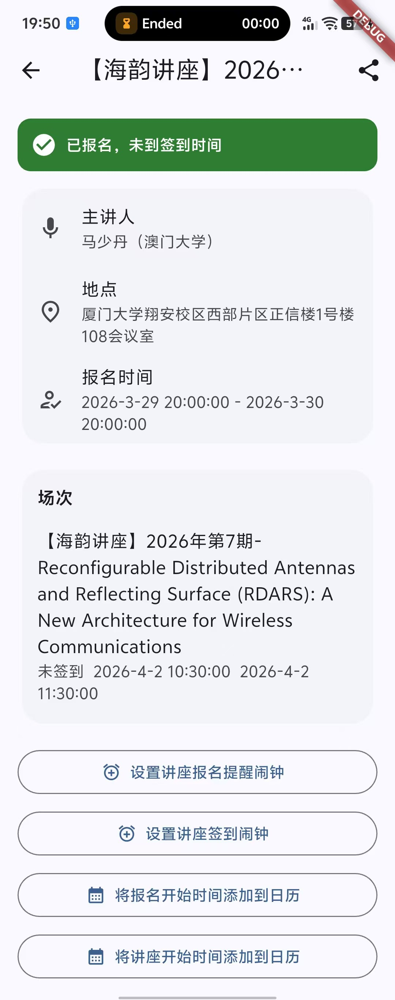
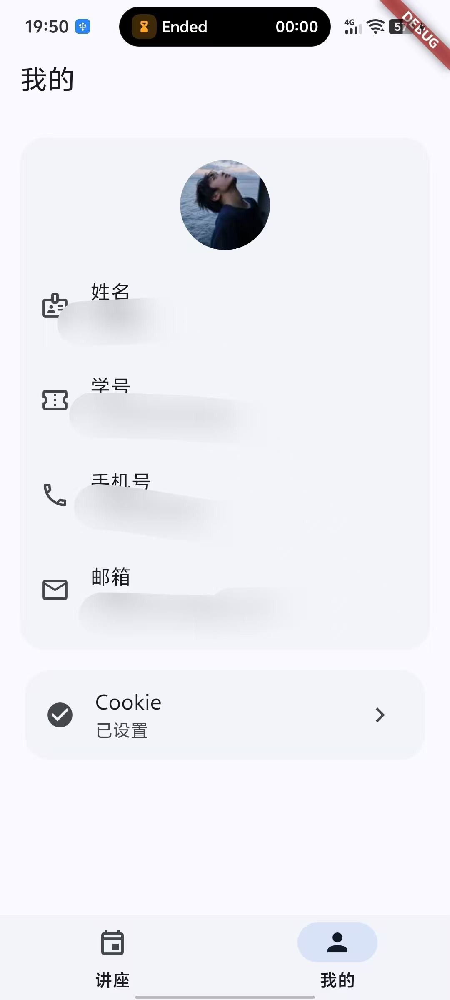

# xiaxinfeixiang — 厦信飞翔讲座

[中文](README.zh-CN.md)

> Android app for browsing and managing lectures on the XMU "厦信飞翔" platform.

## Screenshots

<p align="center">
  
  
  
</p>

## Features

- **My Sign-ups** — view all lectures you have registered for, with host, sign-up start time, venue and status
- **My Sign-ins** — view lectures you have already signed in to
- **Lecture detail** — host, venue, sign-up window, session list, full description (HTML stripped)
- **Status banner** — real-time banner showing sign-up not started / in progress / closed / already registered
- **Alarm** — set an Android alarm for 20 / 10 / 2 minutes before the lecture or sign-in time
- **Share** — share lecture info (name, host, venue, start time) via system share sheet
- **Profile** — display avatar, name, student ID, phone and email from your account
- **Cookie persistence** — Cookie is stored locally via `shared_preferences`

## Platform

Android supported. macOS / iOS / Windows / Web: TBD.

## Get Cookie (Wireshark capture)

1. Download and install [Wireshark](https://www.wireshark.org/) (desktop).
2. Open WeChat for Windows, enter the "厦信飞翔" Official Account and sign in.
3. In Wireshark, select your active network interface and start capturing.
4. Open / refresh any page in WeChat; filter by `http` or the target domain.
5. Click any request → expand **Hypertext Transfer Protocol** → copy the full `Cookie` header value.

## Run

```bash
flutter pub get
flutter run
```

## Build Android APK

```bash
flutter build apk --release
```

Output: `build/app/outputs/flutter-apk/app-release.apk`

## Set Cookie

Tap the cookie icon (top-right of any page) or go to **我的 → Cookie**, paste the full `Cookie` string and save.
Cookie format example: `deviceKey=951b74c7-f351-4704-a20c-b434f85ddcbe`

Note: Cookie expires. If requests start failing, capture and set a new Cookie.
